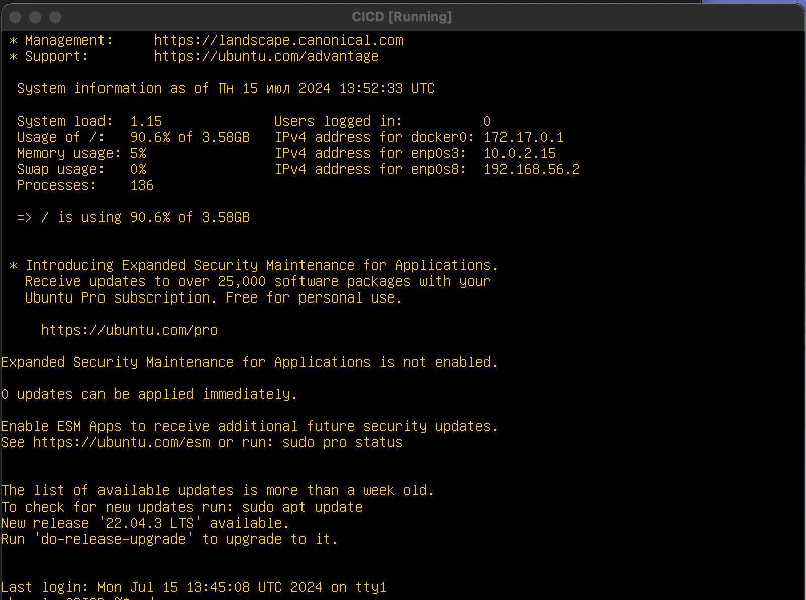
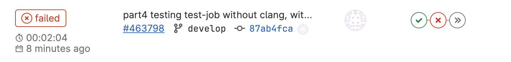
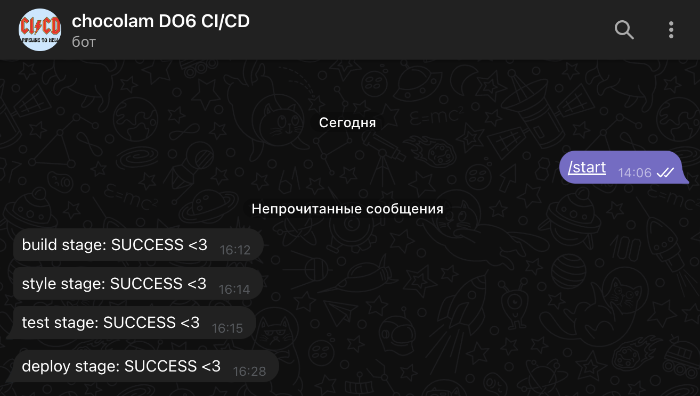

## Part 1. Настройка gitlab-runner

- Подними виртуальную машину Ubuntu Server 22.04 LTS



- Скачай и установи на виртуальную машину gitlab-runner


- Запусти gitlab-runner и зарегистрируй его для использования в текущем проекте (DO6_CICD)

1. берем URL и токен со страницы проекта


2. регистрируем gitlab-runner, вводим:

- URL-адрес GitLab
- токен
- название раннера
- теги для заданий (через запятую)
- тип оболочки


## Part 2. Сборка

#### Напиши этап для CI по сборке приложений из проекта C2_SimpleBashUtils.

1. В корне репозитория создать файл .gitlab-ci.yml

```ssh
touch .gitlab-ci.yml
```

2. В файле gitlab-ci.yml добавь этап запуска сборки через мейк файл из проекта C2. Файлы, полученные после сборки (артефакты), сохрани в произвольную директорию со сроком хранения 30 дней


3. после пуша появилась ошибка:


- Эта ошибка может возникать из-за проблем при загрузке профиля оболочки (shell) в GitLab Runner, в профиле оболочки есть команды или настройки, которые приводят к ошибке при выполнении GitLab CI задачи. Для исправления ошибки нужно закомментировать строки в `/home/gitlab-runner/.bash_logout`


- после исправлений стадия фейлилась. чтобы этого не было - нужно установить gcc и make на машину, после этого стадия завершается успешно


## Part 3. Тест кодстайла

#### Напиши этап для CI, который запускает скрипт кодстайла (clang-format):

1) пишем скрипт, который фейлит пайплайн если `clang-format` выводит ошибки:


- устанавливаем на машину `clang-format` и пушим в гитлаб, видим, что стадия завершается успешно


- делаем ошибку в коде, чтобы `clang` начал ругаться


- проверяем, что стадия зафейлилась


## Part 4. Интеграционные тесты

#### Напиши этап для CI, который запускает твои интеграционные тесты из того же проекта

1) пишем скрипт, который фейлит пайплайн если в тестах есть ошибки:


2) пушим, проверяем с успешными тестами:


3) вручную фейлим один из тестов


4) проверяем с зафейленным тестом:


#### Запусти этот этап автоматически только при условии, если сборка и тест кодстайла прошли успешно

1) делаем стилевую ошибку в `cat.c`, чтобы предыдущая стадия фейлилась и добавляем правило, которое запускает нашу стадию только если предыдущие стадии прошли успешно


2) проверяем наш пайплайн



3) убираем ошибки из `cat.c` и снова проверяем пайплайн, что все проходит без ошибок


## Part 5. Этап деплоя

#### Подними вторую виртуальную машину Ubuntu Server 22.04 LTS.


- настраиваем внутреннюю сеть

 

- проверяем соединение между машинами

 

- для удобства подключаюсь к каждой машине через VSCode и генерирую ssh-ключ на второй машине (на первой он уже у меня есть)


- добавляем ключ второй машины в гитлаб

#### Напиши этап для CD, который «разворачивает» проект на другой виртуальной машине

- дописываем этап деплоя на первой машине, который при помощи ssh и scp копирует файлы, полученные после сборки (артефакты), в директорию `/usr/local/bin` второй виртуальной машины


- переходим в пользователя gitlab-runner с помощью `sudo su gitlab-runner`


- генерируем ssh-ключ


- пробрасываем ключ на вторую машину (`ssh-copy-id chocolam@192.10.10.2`)


- проверить можно на второй машине с помощью команды `cat ~/.ssh/authorized_keys`


- возвращаемся на своего пользователя и даём пользователю gitlab-runner больше прав (`sudo usermod -aG sudo gitlab-runner`)


- на второй машине даём права к директории `/usr/local/bin`


#### Запусти этот этап вручную при условии, что все предыдущие этапы прошли успешно

- блок кода для запука этапа вручную


- проверяем в гитлабе, что этап нужно запускать вручную


- после некоторой отладки скрипта деплой прошел успешно


#### Проверяем, что этап фейлится в случае ошибки

- немного меняем скрипт чтобы "копировался" неправильный файл (перед этим удаляем артефакты со второй машины)


- пушим, ждем пока пройдут 3 этапа, запускаем этап деплоя, проверяем


- возвращаем всё в исходное состояние

## Part 6. Дополнительно. Уведомления

#### Настрой уведомления о успешном/неуспешном выполнении пайплайна через бота с именем «[твой nickname] DO6 CI/CD» в Telegram

- находим BotFather в телеграме, создаем нового бота


- ищем бота getmyid_bot и пишем ему `/start` для получения ID


- добавляем .notify: &notify в файл `.gitlab-ci.yml`, в нем определим набор команд для уведомлений, которые будут использованы во всех этапах

1) подключаем переменные c ID и токеном
2) прописываем сообщение для бота, исходя из результата предыдущего этапа
3) отправляем сообщение боту через `curl` и `ssh`


- в `after_script` каждого этапа прописываем вызов `notify`


- проверяем пайплайн


- проверяем телеграм-бота

